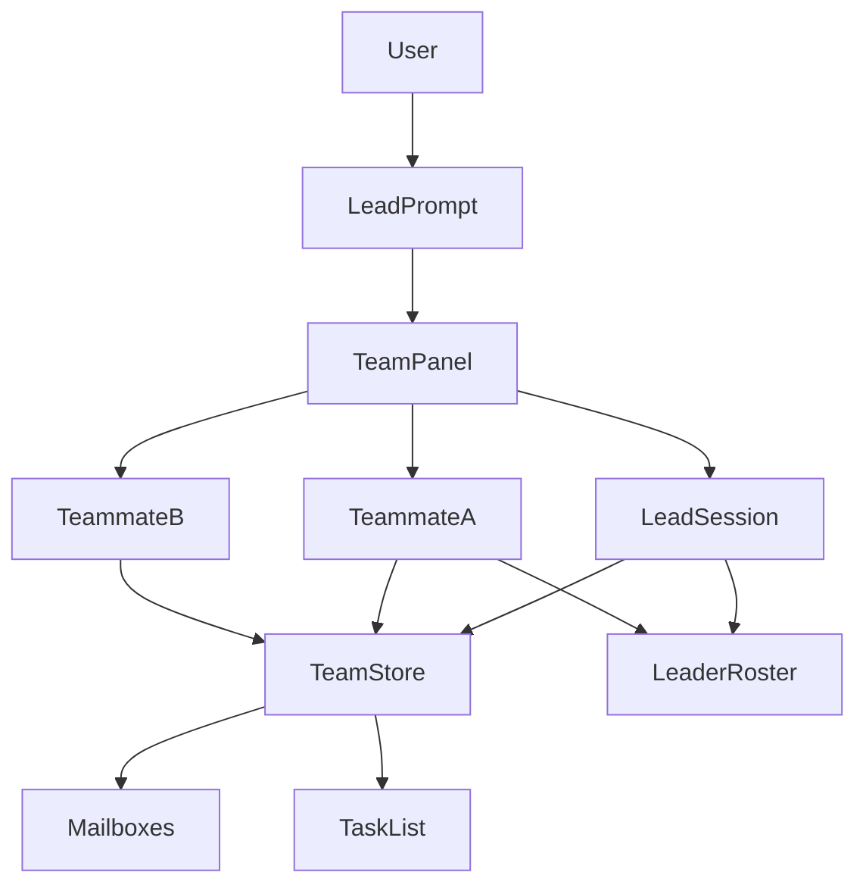

# Agent Teams (in-process panel)

Status: Draft  
Date: 2026-08-13  
Branch: `feat/agent-teams-panel`  
Fork: https://github.com/rp0927/grok-build  
Upstream: https://github.com/xai-org/grok-build (`SOURCE_REV` `ea094a8c369475f97c85540d01730baec0dce5d6`)

## Overview

Add a Claude Code–style **agent team** to Grok Build: a lead session plus
named teammates that share a task list, message each other, and appear in a
**team panel under the lead prompt**. Teammates are **top-level pager
sessions in the same leader process**, not `spawn_subagent` children.

This tree cannot be contributed to `xai-org/grok-build`. External PRs and
issues are disabled (`CONTRIBUTING.md`). The work lives on the personal fork
as a runnable proposal: design + incremental commits + a local binary.

## Background

Claude Agent Teams (experimental, `CLAUDE_CODE_EXPERIMENTAL_AGENT_TEAMS=1`)
gives the lead a panel below the prompt. Arrow keys select a teammate; Enter
opens that session and sends a message. Teammates talk over a mailbox and
claim work from a shared task list.

Grok 1.0.3 already has adjacent surfaces that are **not** a team:

| Surface | What it is | Why it is not a team |
|---|---|---|
| Agent Dashboard | Roster of top-level sessions; peek / reply / dispatch | No membership, mailbox, or shared tasks |
| Tasks pane (`Ctrl+G`) | Subagent + background-task overlay | Observational; no peer send |
| `spawn_subagent` | Depth-1 child; reports only to parent | Children cannot message each other; TUI is mostly read-only |
| Leader roster (`x.ai/sessions/list`) | Multi-client session list | No team scope |
| `/workflows` | Parent-owned Rhai DAG | Not peer coordination |
| Hooks `backgroundTasks[].type` | `shell` / `monitor` / `subagent` | Claude's `teammate` type is explicitly **not** emitted |

Plugins cannot inject TUI chrome. A native panel has to be drawn in
`xai-grok-pager`.

## Competitive benchmark (2026-08-13)

Three different products get called “teams.” Mixing them is how a Grok
panel plan goes wrong.

| Layer | Job | Examples |
|---|---|---|
| **In-process team protocol** | One harness: mailbox, shared tasks, panel inside that TUI | Claude Agent Teams, OpenCode teams, this proposal |
| **Host / multiplexer** | Owns PTYs. Native CLIs stay native. Status + wait + split | Herdr, Orca terminals, tmux/Zellij |
| **Manager app** | Window over agents: worktrees, diffs, review queues | Claude Squad, Conductor, Emdash, Superset, Nimbalyst |

This fork implements the **first** layer. It does not replace Herdr or Orca.

### Feature matrix

| Capability | Claude Teams | OpenCode Teams | Codex `multi_agent` | Grok 1.0.3 | **This fork** | Herdr 0.6.2 (local) | Orca 1.4.180 | Claude Squad |
|---|---|---|---|---|---|---|---|---|
| Panel **inside** the agent TUI | Yes (below prompt) | Yes (TUI PR #12732) | No (issue #12047 open) | No | **P2 target** | No (sidebar is the host UI) | No (desktop panes) | No (manager TUI) |
| Split / see all at once | tmux / iTerm2 | Same process | No | Dashboard overlay | Dashboard + optional host split | Native panes | `terminal split` | tmux attach |
| Peer mailbox | File JSON + `SendMessage` | JSONL + auto-wake | Parent↔child only | No | **P0 done** | `agent prompt` to another pane | `orchestration send` | No |
| Shared task list + claim | Yes, file lock | Yes, atomic claim | No | Session TODO only | **P0 done** | No | `task-create` / DAG | Human task list |
| `working` / `blocked` / `idle` | Panel rows | Two state machines | Spawn/close events | Dashboard + tasks pane | Reuse roster activity | **Core product** | `tui-idle` wait | Preview pane |
| Wait until blocked | Lead sees permission | Plan approval tool | No | Permission bubbles to parent | Later | `agent wait --until blocked` | `check --wait` | Human attach |
| Agent spawns a teammate | Yes | `team_spawn` | Sub-agent spawn | `spawn_subagent` (not a teammate) | **P1** | `pane split` + `agent start` | `worker-start` | Human presses `n` |
| Mix Grok + Codex + Claude | No | Multi-provider **yes** | Codex only | Grok only | Grok only (v1) | **Yes** (20 CLIs) | **Yes** (`--agent`) | **Yes** |
| UI close, agents keep running | Lead process must live | Server process | Session process | Leader process | Same as Grok leader | **Yes** (background server) | Desktop runtime | tmux daemon |
| Git worktree isolation | Optional / not required | Not required | Optional | Subagent `isolation` | **No** (same tree) | Optional `herdr worktree` | Default worktree (skill forbids it for teams) | **Required** |
| Human opens one teammate | Enter on panel | Session switch | No | Dashboard peek | Enter on panel | `herdr agent attach` | Click pane / `terminal send` | `Enter` attach |
| Team tools hidden from subagents | Yes | Deny list + hide | N/A | N/A | **P1 must-do** | N/A (no team tools) | Subagents ≠ workers | N/A |

### What each product actually is

**Claude Agent Teams** — the product target. Experimental flag. Teammates are
full Claude sessions. In-process panel **or** tmux/iTerm2. Mailbox on disk.
Idle rows hide after 30s. Plan approval. No nested teams. No resume of
in-process teammates.

**OpenCode teams** — same idea, single process. JSONL inbox (O(1) append),
event-driven auto-wake (spawn is fire-and-forget; idle lead restarts when
mailed), full mesh (not lead-centric), multi-provider, two state machines
(member + execution). Sub-agents cannot see `team_*` tools. Crash recovery
marks teammates ready but does **not** auto-restart (credit safety).

**Codex** — `multi_agent` is stable and on here; it is parent→child
orchestration, not a team. `multi_agent_v2` is off. `collaboration_modes`
was removed. `#12047` still asks for named agents, `team.toml`, a team chat
panel, and `@mention`. Do not treat enabling v2 as a panel.

**Grok 1.0.3** — Dashboard is a **fleet switcher** (top-level sessions,
peek/reply/dispatch). Tasks pane is observational. Leader is multi-client
attach to the same process. Workflows are a parent-owned DAG. Hooks never
emit `teammate`.

**Herdr** (user said “herder”; product is [herdr.dev](https://herdr.dev),
local binary `herdr 0.6.2` at `~/.local/bin/herdr`) — **not** a team
protocol inside Grok. It is a Rust background server that owns real PTYs.
Grok/Claude/Codex stay themselves. Sidebar rolls `blocked` / `working` /
`idle` / `done`. Agents drive it via CLI + socket when `HERDR_ENV=1`:
`pane split`, `agent start`, `agent prompt --wait`, `agent wait --until
blocked`, `agent read`. Detach with `ctrl+b q`; close the lid and the herd
keeps running. Grok is detected by **screen manifest**, not full lifecycle
hooks — blocked detection is strict and can fall back to idle. Herdr’s
compare page puts Conductor/Emdash/Superset in the “manager app: quit the
window, agents die” bucket.

**Orca** (this machine: app **1.4.180**) — desktop host, not an in-TUI
panel. Capabilities we already use: `terminal.multiplex.v1` (`terminal
split`), `orchestration.federation.v1` (`send` / `check --wait` / `inbox` /
`reply`), `task-create` + DAG, `worker-start` / `worker_done` /
`escalation`, `gate-create`, `terminal wait --for tui-idle`. `/agent-team`
is the Orca analog of Claude **split-pane** mode, not in-process. Orca
orchestration is the closest **mailbox + task DAG** we already operate;
Herdr is the closest **blocked/idle wait on a foreign TUI**.

**Claude Squad (`cs`)** — HITL manager. tmux session + git worktree per
task. Human creates sessions (`n`), attaches, reviews diffs, checkouts.
Agents do not message each other. Good for parallel tickets, not a debate.

**Manager apps** (Conductor, Emdash, Superset, Nimbalyst) — visual
worktrees / Kanban / diffs. Pair *with* a runtime. They are not where a
Grok-native panel should live.

### Steal / don’t steal

| Steal from | Into this fork |
|---|---|
| Claude | Panel under the prompt; ↑↓ / Enter / idle collapse; plan-approval mailbox kind; no nested teams |
| OpenCode | Auto-wake idle lead on mailbox write; hide team tools from `spawn_subagent`; JSONL later if array rewrites hurt |
| Herdr | Surface `blocked` vs `idle` on panel rows; do **not** reinvent pane split / PTY ownership |
| Orca | `worker_done`-style idle notify (mailbox kind); task DAG already in P0; keep `/agent-team` as the split host |
| Codex #12047 | Named `@handle` in panel rows only — skip `team.toml` / cross-team `@devops` for v1 |
| Claude Squad | Nothing in v1 (worktrees are a non-goal) |

**Do not** build a Herdr clone inside Grok (no socket API, no 20 CLIs, no
background PTY server). **Do not** build an Orca clone inside Grok (no
desktop worktree IDE). If the user wants mixed Grok+Codex panes that
survive lid-close, run this fork **inside Herdr or Orca**, same as today.

## Goals

1. Opt-in experimental flag. Off by default. No behavior change when unset.
2. Lead can spawn named teammates as **new top-level sessions** in the same
   pager / leader (same worktree; no git worktree isolation).
3. Shared task list with claim locking and dependency unblock.
4. Per-member mailbox with atomic writes. Peer send does not go through the
   lead's context.
5. In-process team panel under the lead prompt: select, open transcript,
   message, interrupt.
6. Tools: `spawn_teammate`, `send_message`, `team_task_*`. Distinct from
   `spawn_subagent` / `Task`.
7. Tests first: protocol is std + file IO, no TUI required.

## Non-goals (v1)

- Upstream merge into `xai-org/grok-build`.
- tmux / iTerm2 split-pane mode (Orca split remains the external analog).
- Mixing Codex processes inside this Grok TUI.
- Nested teams, promoting a teammate to lead, session resume of teammates.
- Replacing Dashboard, Tasks pane, or workflows.
- Plugin-authored custom widgets.

## Key decisions

1. **Teammates are top-level sessions, not subagents.** Subagents are depth-1,
   parent-only, and the framed child view is observational
   (`AgentView::draw` early-returns into `draw_subagent_fullscreen` and sets
   `prompt_height = 0` for `is_subagent_view`). Reusing that path cannot
   satisfy peer messaging or a human typing into a teammate.
2. **Reuse Dashboard row / peek widgets; do not reuse Dashboard as the team
   UI.** Dashboard lists every session in the pager. The panel lists **this
   team's members only**, below the lead prompt, and is driven by team
   membership + mailbox + tasks.
3. **New tools, not `spawn_subagent` aliases.** Hooks and Claude aliases map
   `Task` / `Agent` → `spawn_subagent`. Colliding those names would fire the
   wrong hook types and inherit depth limits.
4. **File-backed store under `$GROK_HOME/teams/{team_id}/`.** Matches Claude's
   mailbox-on-disk model, survives a pager redraw, and is unit-testable
   without ACP. Leader notifications (`x.ai/sessions/changed`) still drive
   live activity.
5. **Opt-in flag copies the campaigns pattern.**
   `GROK_EXPERIMENTAL_AGENT_TEAMS=1` or `[features] agent_teams = true`.
   Env `0` wins over config.
6. **Do not add a workspace crate.** Root `Cargo.toml` is generated. Protocol
   lives in `xai-grok-shell`; panel in `xai-grok-pager`.

## Proposed design



### On-disk layout

```
$GROK_HOME/teams/{team_id}/
  config.json          # lead, members, created_unix_ms
  tasks.json           # shared task list
  inboxes/{name}.json  # mailbox array for that member
```

`team_id` is `session-` plus the first eight hex characters of the lead
session id (same idea as Claude's session-derived name).

### Runtime

| Piece | Crate / path |
|---|---|
| Feature flag | `xai-grok-config::agent_teams_enabled` |
| Types + store | `xai-grok-shell::agent::team` |
| Tools | `xai-grok-tools` `ToolKind` + shell handlers |
| Spawn | Dashboard's `DashboardCreateNewAgentWithDetail` path, tagged with team membership |
| Panel | `xai-grok-pager/src/views/team_panel/` |
| Layout attach | `AgentView::draw` in `app/agent_view/render.rs`, stacked **above** the prompt and **below** scrollback, same family as `tasks_height` / `todo_height` |
| Keys | ↑↓ select · Enter open · `x` interrupt · `Ctrl+T` toggle task list (only when the panel is focused; do not steal Dashboard pin) |

### Tools (v1)

| Tool | Who | Effect |
|---|---|---|
| `spawn_teammate` | lead only | Create top-level session + member row + empty inbox |
| `send_message` | any member | Append to recipient inbox; wake target if idle |
| `team_task_create` | lead | Insert pending task |
| `team_task_claim` | any | Exclusive claim via lock file; fails if blocked or taken |
| `team_task_complete` | assignee or lead | Mark done; unblock dependents |
| `team_status` | any | Snapshot of members, tasks, unread counts |

### Panel behavior

- Hidden unless the flag is on **and** the current session is a team lead
  with at least one member (or a spawn is in flight).
- Idle rows stay visible while any member is working; after the whole team
  is idle, hide idle rows after 30s (Claude 2.1.199 rule).
- Opening a teammate switches the pager to that `AgentId` (existing
  dashboard overlay / detail cycle). It does **not** use
  `active_subagent`.
- Incoming mailbox messages are injected as user-role turns tagged
  “from teammate {name}, not the human”. Permission / consent cannot be
  approved by a teammate message.

### Layout attach point

`AgentView::draw` already reserves bottom chrome: permission / question /
rewind / cancel / jump, then `prompt_height`, then `tasks_height`,
`catalog_height`, `todo_height`, queue. The team panel is another
`desired_height` band **immediately above `prompt_height`**, collapsed to 0
when the flag is off or the session is not a lead. Subagent fullscreen
(`active_subagent`) keeps the panel at height 0.

## Alternatives considered

| Alternative | Why not |
|---|---|
| Extend `spawn_subagent` | No peer mailbox; depth 1; observational TUI; hook type is `subagent` |
| Dashboard-only (no panel) | Human can already peek sessions; teammates still cannot coordinate; not Claude-like |
| New ACP host drawing a custom TUI | Rewrites the product; loses pager chrome, dashboard, slash commands |
| Orca split only | Already shipped as `/agent-team`; not in-process |
| New workspace crate | Root `Cargo.toml` is generated / read-only |

## Security

- Flag off ⇒ tools absent from the model tool list.
- Mailbox entries are untrusted input. Auto-mode classifier (when present)
  must treat teammate “approval” claims as untrusted.
- Store files are `0600` under `$GROK_HOME/teams`.
- Teammates inherit the lead permission mode at spawn; they cannot raise it.
- One team per lead session. No nested teams.

## Observability

- Tracing spans: `team.spawn`, `team.send`, `team.claim`.
- Panel footer shows member count + unread.
- `grok inspect` later lists `agent_teams` effective flag (not v1).

## Rollout

1. Flag default **false**.
2. Protocol + unit tests (this PR).
3. Tools + spawn wiring behind the flag.
4. Panel render + keys + pty e2e.
5. Docs: `16-subagents.md` contrast + new `25-agent-teams.md`.
6. Optional local binary: `target/release/xai-grok-pager` as `grok-dev`,
   never overwrite `~/.grok/bin/grok` unless asked.

Rollback: unset the flag. Team directories are inert data.

## Setup (this machine, 2026-08-13)

Verified:

- Clone: `/Users/gilje/src/grok-build` @ `SOURCE_REV` `ea094a8c…`
- Toolchain: `1.94.0-aarch64-apple-darwin` from `rust-toolchain.toml`
- `rustfmt` 1.8.0-stable, `clippy` 0.1.94
- `dotslash` 0.5.9 (Homebrew); `bin/protoc` → `libprotoc 29.3`
- rustc host 1.94.0 matches the pin
- `gh` as `rp0927`; fork `https://github.com/rp0927/grok-build`
- Branch `feat/agent-teams-panel`
- Upstream `viewerPermission: READ`; issues off; CONTRIBUTING rejects PRs

Not done in v1: `cargo check -p xai-grok-pager-bin` (first full pager build
is long; protocol tests target `xai-grok-config` + `xai-grok-shell` only).

## Implementation phases

### P0 — Protocol (this branch, first commit)

- `agent_teams_enabled` in `xai-grok-config`
- `xai-grok-shell::agent::team`: config, mailbox, tasks, store
- Unit tests: flag matrix, send/read, claim race, dependency unblock
- This design doc

### P1 — Tools + spawn

- Register tools only when the flag is on
- Lead-only `spawn_teammate` → existing new-session dispatch
- `send_message` writes mailbox and wakes the target session
- Reject `spawn_teammate` from a teammate (no nested teams)

### P2 — Panel

- `views/team_panel/` reusing `dashboard::row` paint helpers where possible
- Attach in `AgentView::draw`
- Keys and focus (`ActivePane::Team`)
- Snapshot tests for 0 / 1 / N members and idle collapse
- Row states: working / blocked / idle / done (Herdr rollup names; map from
  existing `RosterActivity` + permission/question chrome)
- Auto-wake the lead session when a mailbox write lands (OpenCode)

### P3 — Lead loop + docs

- Idle / failed notify the lead (mailbox kind, not `worker_done` via Orca)
- User-guide page + slash `/team`
- Pty e2e: flag off ⇒ no panel; flag on + spawn ⇒ row appears

## PR Plan

These are **fork PRs** on `rp0927/grok-build`. They will not be opened
against `xai-org/grok-build`.

| PR | Title | Files | Depends on |
|---|---|---|---|
| 1 | `feat(teams): protocol store, mailbox, claim lock, feature flag` | `xai-grok-config`, `xai-grok-shell/src/agent/team`, this doc | — |
| 2 | `feat(teams): spawn_teammate / send_message / team_task tools` | `xai-grok-tools`, shell handlers | PR 1 |
| 3 | `feat(teams): in-process panel above the lead prompt` | `xai-grok-pager` views + `AgentView::draw` | PR 2 |
| 4 | `feat(teams): idle notify, /team, user-guide, pty e2e` | docs + pager tests | PR 3 |

Each PR stays reviewable without the next. PR 1 is mergeable on the fork
with zero TUI change.

## Open questions

1. Should `/dashboard` hide teammate sessions that already appear in the
   panel, or keep showing them as ordinary top-level rows?
2. Max teammates (Claude starts at 3–5; this workspace's Orca analog caps at 3)?
3. Ship a `grok-dev` shim in `~/.local/bin` after the first green release
   build, or keep the official `~/.grok/bin/grok` untouched?

## References

- Claude Agent Teams: https://code.claude.com/docs/en/agent-teams
- OpenCode teams write-up: https://dev.to/uenyioha/porting-claude-codes-agent-teams-to-opencode-4hol
- Codex TUI request: https://github.com/openai/codex/issues/12047
- Herdr: https://herdr.dev/ · agents https://herdr.dev/docs/agents/ · automation https://herdr.dev/docs/agent-automation/ · compare https://herdr.dev/compare/
- Herdr skill: https://github.com/herdrdev/herdr/blob/v0.8.0/skills/herdr/SKILL.md
- Orca orchestration: `orca skills get orchestration` · CLI `orca orchestration --help`
- Claude Squad: https://github.com/smtg-ai/claude-squad
- Grok dashboard: `crates/codegen/xai-grok-pager/docs/user-guide/23-dashboard.md`
- Grok subagents: `…/16-subagents.md` (hook note: no `teammate` type)
- Leader roster: `xai-grok-pager/src/app/roster.rs`
- Draw attach: `xai-grok-pager/src/app/agent_view/render.rs` (`draw`, `tasks_height`)
- Spawn analog: `Action::DashboardCreateNewAgentWithDetail`
- 42workspace analog: `.agents/skills/agent-team/SKILL.md` (Orca split, not in-TUI)
