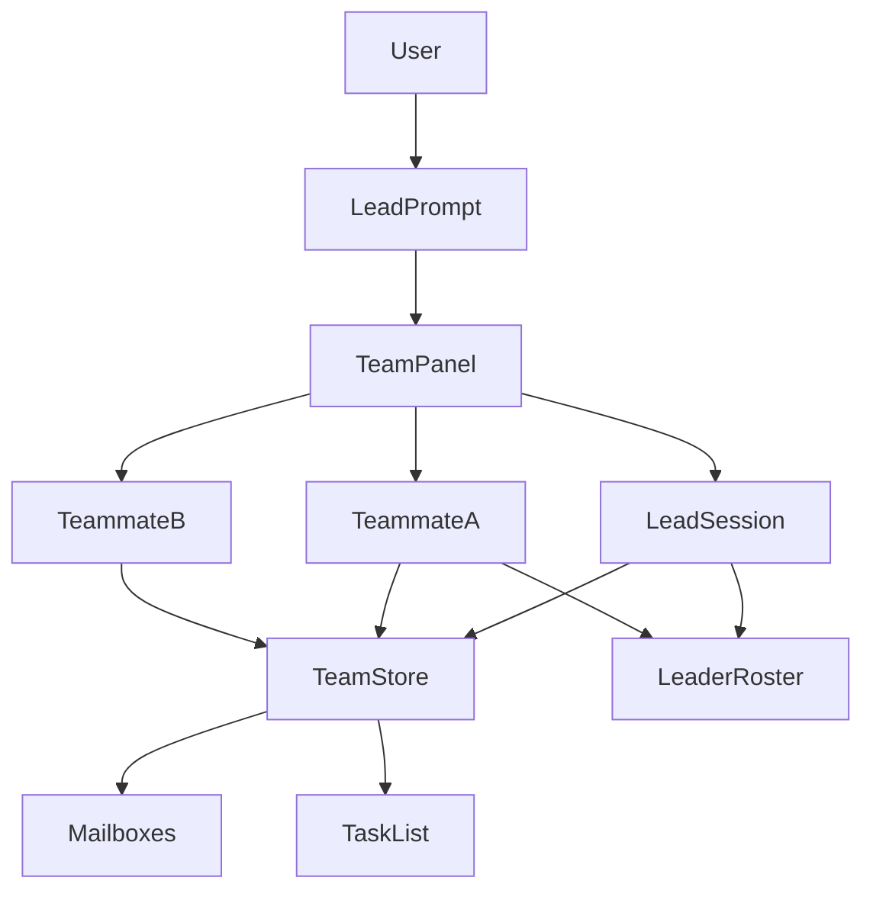

# Agent Teams (in-process panel)

Status: Draft  
Date: 2026-08-13  
Branch: `feat/agent-teams-panel`  
Fork: https://github.com/rp0927/grok-build  
Upstream: https://github.com/xai-org/grok-build (`SOURCE_REV` `ea094a8c369475f97c85540d01730baec0dce5d6`)

## Overview

Add a Claude Code–style **agent team** to Grok Build: a lead session plus
named teammates that share a task list, message each other, and appear in a
**team panel under the lead prompt**. Teammates are **top-level pager
sessions in the same leader process**, not `spawn_subagent` children.

This tree cannot be contributed to `xai-org/grok-build`. External PRs and
issues are disabled (`CONTRIBUTING.md`). The work lives on the personal fork
as a runnable proposal: design + incremental commits + a local binary.

## Background

Claude Agent Teams (experimental, `CLAUDE_CODE_EXPERIMENTAL_AGENT_TEAMS=1`)
gives the lead a panel below the prompt. Arrow keys select a teammate; Enter
opens that session and sends a message. Teammates talk over a mailbox and
claim work from a shared task list.

Grok 1.0.3 already has adjacent surfaces that are **not** a team:

| Surface | What it is | Why it is not a team |
|---|---|---|
| Agent Dashboard | Roster of top-level sessions; peek / reply / dispatch | No membership, mailbox, or shared tasks |
| Tasks pane (`Ctrl+G`) | Subagent + background-task overlay | Observational; no peer send |
| `spawn_subagent` | Depth-1 child; reports only to parent | Children cannot message each other; TUI is mostly read-only |
| Leader roster (`x.ai/sessions/list`) | Multi-client session list | No team scope |
| `/workflows` | Parent-owned Rhai DAG | Not peer coordination |
| Hooks `backgroundTasks[].type` | `shell` / `monitor` / `subagent` | Claude's `teammate` type is explicitly **not** emitted |

Plugins cannot inject TUI chrome. A native panel has to be drawn in
`xai-grok-pager`.

## Goals

1. Opt-in experimental flag. Off by default. No behavior change when unset.
2. Lead can spawn named teammates as **new top-level sessions** in the same
   pager / leader (same worktree; no git worktree isolation).
3. Shared task list with claim locking and dependency unblock.
4. Per-member mailbox with atomic writes. Peer send does not go through the
   lead's context.
5. In-process team panel under the lead prompt: select, open transcript,
   message, interrupt.
6. Tools: `spawn_teammate`, `send_message`, `team_task_*`. Distinct from
   `spawn_subagent` / `Task`.
7. Tests first: protocol is std + file IO, no TUI required.

## Non-goals (v1)

- Upstream merge into `xai-org/grok-build`.
- tmux / iTerm2 split-pane mode (Orca split remains the external analog).
- Mixing Codex processes inside this Grok TUI.
- Nested teams, promoting a teammate to lead, session resume of teammates.
- Replacing Dashboard, Tasks pane, or workflows.
- Plugin-authored custom widgets.

## Key decisions

1. **Teammates are top-level sessions, not subagents.** Subagents are depth-1,
   parent-only, and the framed child view is observational
   (`AgentView::draw` early-returns into `draw_subagent_fullscreen` and sets
   `prompt_height = 0` for `is_subagent_view`). Reusing that path cannot
   satisfy peer messaging or a human typing into a teammate.
2. **Reuse Dashboard row / peek widgets; do not reuse Dashboard as the team
   UI.** Dashboard lists every session in the pager. The panel lists **this
   team's members only**, below the lead prompt, and is driven by team
   membership + mailbox + tasks.
3. **New tools, not `spawn_subagent` aliases.** Hooks and Claude aliases map
   `Task` / `Agent` → `spawn_subagent`. Colliding those names would fire the
   wrong hook types and inherit depth limits.
4. **File-backed store under `$GROK_HOME/teams/{team_id}/`.** Matches Claude's
   mailbox-on-disk model, survives a pager redraw, and is unit-testable
   without ACP. Leader notifications (`x.ai/sessions/changed`) still drive
   live activity.
5. **Opt-in flag copies the campaigns pattern.**
   `GROK_EXPERIMENTAL_AGENT_TEAMS=1` or `[features] agent_teams = true`.
   Env `0` wins over config.
6. **Do not add a workspace crate.** Root `Cargo.toml` is generated. Protocol
   lives in `xai-grok-shell`; panel in `xai-grok-pager`.

## Proposed design



### On-disk layout

```
$GROK_HOME/teams/{team_id}/
  config.json          # lead, members, created_unix_ms
  tasks.json           # shared task list
  inboxes/{name}.json  # mailbox array for that member
```

`team_id` is `session-` plus the first eight hex characters of the lead
session id (same idea as Claude's session-derived name).

### Runtime

| Piece | Crate / path |
|---|---|
| Feature flag | `xai-grok-config::agent_teams_enabled` |
| Types + store | `xai-grok-shell::agent::team` |
| Tools | `xai-grok-tools` `ToolKind` + shell handlers |
| Spawn | Dashboard's `DashboardCreateNewAgentWithDetail` path, tagged with team membership |
| Panel | `xai-grok-pager/src/views/team_panel/` |
| Layout attach | `AgentView::draw` in `app/agent_view/render.rs`, stacked **above** the prompt and **below** scrollback, same family as `tasks_height` / `todo_height` |
| Keys | ↑↓ select · Enter open · `x` interrupt · `Ctrl+T` toggle task list (only when the panel is focused; do not steal Dashboard pin) |

### Tools (v1)

| Tool | Who | Effect |
|---|---|---|
| `spawn_teammate` | lead only | Create top-level session + member row + empty inbox |
| `send_message` | any member | Append to recipient inbox; wake target if idle |
| `team_task_create` | lead | Insert pending task |
| `team_task_claim` | any | Exclusive claim via lock file; fails if blocked or taken |
| `team_task_complete` | assignee or lead | Mark done; unblock dependents |
| `team_status` | any | Snapshot of members, tasks, unread counts |

### Panel behavior

- Hidden unless the flag is on **and** the current session is a team lead
  with at least one member (or a spawn is in flight).
- Idle rows stay visible while any member is working; after the whole team
  is idle, hide idle rows after 30s (Claude 2.1.199 rule).
- Opening a teammate switches the pager to that `AgentId` (existing
  dashboard overlay / detail cycle). It does **not** use
  `active_subagent`.
- Incoming mailbox messages are injected as user-role turns tagged
  “from teammate {name}, not the human”. Permission / consent cannot be
  approved by a teammate message.

### Layout attach point

`AgentView::draw` already reserves bottom chrome: permission / question /
rewind / cancel / jump, then `prompt_height`, then `tasks_height`,
`catalog_height`, `todo_height`, queue. The team panel is another
`desired_height` band **immediately above `prompt_height`**, collapsed to 0
when the flag is off or the session is not a lead. Subagent fullscreen
(`active_subagent`) keeps the panel at height 0.

## Alternatives considered

| Alternative | Why not |
|---|---|
| Extend `spawn_subagent` | No peer mailbox; depth 1; observational TUI; hook type is `subagent` |
| Dashboard-only (no panel) | Human can already peek sessions; teammates still cannot coordinate; not Claude-like |
| New ACP host drawing a custom TUI | Rewrites the product; loses pager chrome, dashboard, slash commands |
| Orca split only | Already shipped as `/agent-team`; not in-process |
| New workspace crate | Root `Cargo.toml` is generated / read-only |

## Security

- Flag off ⇒ tools absent from the model tool list.
- Mailbox entries are untrusted input. Auto-mode classifier (when present)
  must treat teammate “approval” claims as untrusted.
- Store files are `0600` under `$GROK_HOME/teams`.
- Teammates inherit the lead permission mode at spawn; they cannot raise it.
- One team per lead session. No nested teams.

## Observability

- Tracing spans: `team.spawn`, `team.send`, `team.claim`.
- Panel footer shows member count + unread.
- `grok inspect` later lists `agent_teams` effective flag (not v1).

## Rollout

1. Flag default **false**.
2. Protocol + unit tests (this PR).
3. Tools + spawn wiring behind the flag.
4. Panel render + keys + pty e2e.
5. Docs: `16-subagents.md` contrast + new `25-agent-teams.md`.
6. Optional local binary: `target/release/xai-grok-pager` as `grok-dev`,
   never overwrite `~/.grok/bin/grok` unless asked.

Rollback: unset the flag. Team directories are inert data.

## Setup (this machine, 2026-08-13)

Verified:

- Clone: `/Users/gilje/src/grok-build` @ `SOURCE_REV` `ea094a8c…`
- Toolchain: `1.94.0-aarch64-apple-darwin` from `rust-toolchain.toml`
- `rustfmt` 1.8.0-stable, `clippy` 0.1.94
- `dotslash` 0.5.9 (Homebrew); `bin/protoc` → `libprotoc 29.3`
- rustc host 1.94.0 matches the pin
- `gh` as `rp0927`; fork `https://github.com/rp0927/grok-build`
- Branch `feat/agent-teams-panel`
- Upstream `viewerPermission: READ`; issues off; CONTRIBUTING rejects PRs

Not done in v1: `cargo check -p xai-grok-pager-bin` (first full pager build
is long; protocol tests target `xai-grok-config` + `xai-grok-shell` only).

## Implementation phases

### P0 — Protocol (this branch, first commit)

- `agent_teams_enabled` in `xai-grok-config`
- `xai-grok-shell::agent::team`: config, mailbox, tasks, store
- Unit tests: flag matrix, send/read, claim race, dependency unblock
- This design doc

### P1 — Tools + spawn

- Register tools only when the flag is on
- Lead-only `spawn_teammate` → existing new-session dispatch
- `send_message` writes mailbox and wakes the target session
- Reject `spawn_teammate` from a teammate (no nested teams)

### P2 — Panel

- `views/team_panel/` reusing `dashboard::row` paint helpers where possible
- Attach in `AgentView::draw`
- Keys and focus (`ActivePane::Team`)
- Snapshot tests for 0 / 1 / N members and idle collapse

### P3 — Lead loop + docs

- Idle / failed notify the lead (mailbox kind, not `worker_done` via Orca)
- User-guide page + slash `/team`
- Pty e2e: flag off ⇒ no panel; flag on + spawn ⇒ row appears

## PR Plan

These are **fork PRs** on `rp0927/grok-build`. They will not be opened
against `xai-org/grok-build`.

| PR | Title | Files | Depends on |
|---|---|---|---|
| 1 | `feat(teams): protocol store, mailbox, claim lock, feature flag` | `xai-grok-config`, `xai-grok-shell/src/agent/team`, this doc | — |
| 2 | `feat(teams): spawn_teammate / send_message / team_task tools` | `xai-grok-tools`, shell handlers | PR 1 |
| 3 | `feat(teams): in-process panel above the lead prompt` | `xai-grok-pager` views + `AgentView::draw` | PR 2 |
| 4 | `feat(teams): idle notify, /team, user-guide, pty e2e` | docs + pager tests | PR 3 |

Each PR stays reviewable without the next. PR 1 is mergeable on the fork
with zero TUI change.

## Open questions

1. Should `/dashboard` hide teammate sessions that already appear in the
   panel, or keep showing them as ordinary top-level rows?
2. Max teammates (Claude starts at 3–5; this workspace's Orca analog caps at 3)?
3. Ship a `grok-dev` shim in `~/.local/bin` after the first green release
   build, or keep the official `~/.grok/bin/grok` untouched?

## References

- Claude Agent Teams: https://code.claude.com/docs/en/agent-teams
- Grok dashboard: `crates/codegen/xai-grok-pager/docs/user-guide/23-dashboard.md`
- Grok subagents: `…/16-subagents.md` (hook note: no `teammate` type)
- Leader roster: `xai-grok-pager/src/app/roster.rs`
- Draw attach: `xai-grok-pager/src/app/agent_view/render.rs` (`draw`, `tasks_height`)
- Spawn analog: `Action::DashboardCreateNewAgentWithDetail`
- 42workspace analog: `.agents/skills/agent-team/SKILL.md` (Orca split, not in-TUI)
